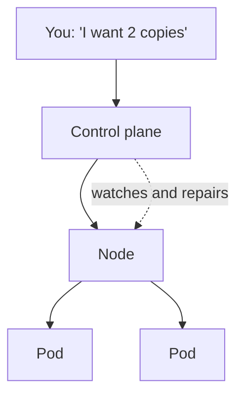
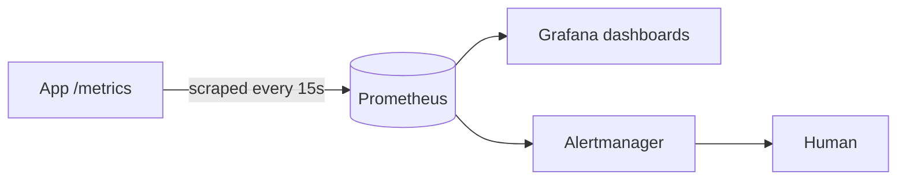

# Unit 4 — Notes
### Kubernetes, DevSecOps and Monitoring

Read alongside the labs. Everything in this unit, in order.

**How to use these notes:** Part A finishes the Kubernetes story from Unit 3 — skim it if that is
still fresh. Parts B and C are new, and every section maps to something you do in the labs.
The two tables worth memorising are **section 5** (SAST vs DAST vs SCA) and **section 12**
(liveness vs readiness).

---

# PART A — Kubernetes in practice

## 1. Where Unit 3 left off

You built an image, pushed it to a registry, and any machine on earth could run it. But you were
still starting containers **one at a time, by hand**, and nothing was watching them.

**Kubernetes** = a system that runs containers across many machines and keeps them in the state
you asked for.

**Desired state** = you declare *what* you want; Kubernetes continuously compares that to reality
and repairs the difference. You never write the *how*.



## 2. The four objects

| Object | Job | Everyday equivalent |
|---|---|---|
| **Pod** | One running copy of your container | One worker |
| **Deployment** | Keeps N pods alive, handles updates | A supervisor |
| **Service** | Stable address + load balancing | The shop's phone number |
| **Node** | A machine in the cluster | A branch office |

A **Service** finds pods by **label**, not by name or IP — which is why pods can be destroyed and
replaced freely without anything else needing to know.

```yaml
# The Deployment labels its pods...
template:
  metadata:
    labels:
      app: web

# ...and the Service looks for that label.
spec:
  selector:
    app: web
```

## 3. Self-healing

Delete a pod that belongs to a Deployment and a replacement appears within seconds. The
Deployment's only job is to keep the declared number of pods running.

This is the single most important idea in the unit: **the system repairs itself because you
described the goal, not the steps.**

---

# PART B — DevSecOps

## 4. Why security moved into the pipeline

The old model: build for months, then hand it to a security team for a review at the end. Two
things go wrong.

1. **Findings arrive too late.** A design flaw found the week before release is enormously
   expensive; the same flaw found at commit time is a ten-minute fix.
2. **It does not scale.** You deploy fifty times a day. No human review keeps up.

**DevSecOps** = building security *into* the delivery pipeline, so it is automatic, continuous
and everyone's job — rather than a gate held by one team at the end.

**Shift left** = move checks earlier (leftward on the pipeline diagram), because the cost of
fixing a problem rises the later you find it.

```
commit ──── build ──── test ──── release ──── production
  │                                              │
 cheap ──────────── cost of fixing ─────────── ruinous
```

> The three ideas in one sentence: **automate the checks, run them early, and make them block.**

## 5. The three kinds of scanning

This is the table to memorise. Interviewers ask for it directly.

| | **SAST** | **DAST** | **SCA** |
|---|---|---|---|
| Stands for | Static Application Security Testing | Dynamic Application Security Testing | Software Composition Analysis |
| Looks at | **Your source code**, not running | **Your running app**, from outside | **Your dependencies** |
| Finds | SQL injection, hardcoded secrets, unsafe functions | Broken auth, XSS, misconfigured headers | Known CVEs in libraries you imported |
| Needs the app running? | No | **Yes** | No |
| When | On every commit | Against a test environment | On every commit |
| Tools | SonarQube, CodeQL, Semgrep | OWASP ZAP, Burp Suite | Trivy, `npm audit`, OWASP Dependency-Check, Snyk |
| Blind spot | Cannot see runtime behaviour | Cannot see code it never reaches | Only knows *published* vulnerabilities |

**Container image scanning** (Trivy on an image) is SCA applied to everything inside the image —
your dependencies *and* the operating system packages in the base image.

> 🎭 SAST reads the recipe. DAST tastes the food. SCA checks whether the ingredients have been
> recalled.

## 6. Why your own image had vulnerabilities

In Lab B you scanned an image built from an **official** base image and found dozens of CVEs.
Nothing was wrong with your code. The reason:

```
your image
 └── node:16-alpine          ← end of life, no longer patched
      └── Alpine Linux packages   ← where nearly all the CVEs live
      └── Node.js runtime
 └── node_modules            ← old pinned libraries
 └── app.js                  ← the only part you wrote
```

You inherit the security posture of everything underneath you. Hence the rules:

| Rule | Why |
|---|---|
| Use a **currently supported** base image | EOL images stop receiving patches entirely |
| Prefer **slim / alpine / distroless** | Fewer packages = fewer CVEs = smaller attack surface |
| **Rebuild regularly** | An image built six months ago is six months out of date, even untouched |
| Never `:latest` in production | You cannot patch what you cannot identify |
| Run as **non-root** (`USER node`) | Limits the damage if the app is compromised |
| `COPY` only what you need | `COPY . .` ships `.git`, `.env` and stray credentials |

> The cheapest security win in containers is almost always **changing one `FROM` line**.

## 7. Secrets

A secret is anything that grants access: passwords, API keys, tokens, certificates.

**The rule: secrets never go in source code.** Not in `config.js`, not in the Dockerfile, not in
the image, not in the YAML.

### Why deleting the line does not help

Git keeps history. A secret committed on Monday and deleted on Tuesday is still readable by
anyone who clones the repository, forever. Bots scan public GitHub for exactly this, continuously,
and exposed cloud keys are typically abused within **minutes**.

**The only real fix is to rotate the secret** — invalidate it at the source so the leaked copy
is worthless. Removing it from history is housekeeping; rotation is the fix.

### Where they should live

| Place | Use |
|---|---|
| Environment variables | How the app reads them at run time |
| **GitHub Secrets** | CI/CD credentials — encrypted, masked in logs |
| Kubernetes Secrets | Values injected into pods |
| Vault, AWS Secrets Manager | Production, with rotation and audit logs |

## 8. Security gates

A report nobody reads changes nothing. A **gate** is a pipeline step that *fails the build* when
a rule is broken.

```
commit → SAST → build → SCA → image scan → 🚪 GATE → registry → deploy
                                             ↑
                          fails here = nothing vulnerable reaches the registry
```

The mechanism is just the **exit code**: a tool exits non-zero, the CI job fails, the pipeline
stops. That is all a gate is.

```yaml
- name: Fail on HIGH or CRITICAL
  uses: aquasecurity/trivy-action@master
  with:
    severity: 'HIGH,CRITICAL'
    ignore-unfixed: true    # don't block on CVEs with no patch available
    exit-code: '1'          # ← the gate
```

### Setting the threshold

Gate on everything and the build is always red, so people start ignoring it or switch it off —
the worst outcome, because now you have the illusion of safety. Practical starting point:

| Severity | Typical policy |
|---|---|
| CRITICAL | Block |
| HIGH | Block, with `ignore-unfixed` |
| MEDIUM / LOW | Report only, review periodically |

**Exceptions must be explicit, dated and commented.** A silent `|| true` is how a pipeline
becomes decorative.

## 9. OWASP Top 10

The Open Worldwide Application Security Project publishes a list of the ten most critical web
application risks. You are not expected to memorise it, but you should recognise the names.

| | Risk | One-line meaning |
|---|---|---|
| A01 | Broken Access Control | Users reach things that are not theirs |
| A02 | Cryptographic Failures | Sensitive data unencrypted or weakly encrypted |
| A03 | Injection | Untrusted input executed as code (SQL, command, XSS) |
| A04 | Insecure Design | The design itself is unsafe; no amount of coding fixes it |
| A05 | Security Misconfiguration | Defaults left on, debug enabled, ports open |
| A06 | **Vulnerable and Outdated Components** | ← *this is the one your scans found* |
| A07 | Identification and Authentication Failures | Weak login, poor session handling |
| A08 | Software and Data Integrity Failures | Trusting unverified code or updates |
| A09 | Logging and Monitoring Failures | The breach happened and nobody noticed |
| A10 | Server-Side Request Forgery | The server is tricked into fetching attacker URLs |

Two of these are directly this unit's labs: **A06** is what Trivy and `npm audit` detect, and
**A09** is what Part C is about.

---

# PART C — Monitoring

## 10. Monitoring, logging, tracing

| | Answers | Example |
|---|---|---|
| **Metrics** | *How much / how many?* Numbers over time | CPU 80%, 300 requests/sec |
| **Logs** | *What exactly happened?* Individual events | `health check failed` |
| **Traces** | *Where did the time go?* One request across services | web → api → db, 400ms total |

Together these are the **three pillars of observability**. Metrics tell you *that* something is
wrong; logs and traces tell you *what* and *where*.

## 11. The four golden signals

For any service, measure these four:

| Signal | Question |
|---|---|
| **Latency** | How long do requests take? |
| **Traffic** | How much demand is there? |
| **Errors** | How many requests are failing? |
| **Saturation** | How full is the system — CPU, memory, disk? |

### Prometheus and Grafana

| Tool | Job |
|---|---|
| **Prometheus** | Collects and stores metrics over time; evaluates alert rules |
| **Grafana** | Draws the dashboards |
| **Alertmanager** | Decides who gets told, and stops alert storms |

Prometheus uses a **pull** model: your app exposes a `/metrics` endpoint, and Prometheus scrapes
it every few seconds. This is worth remembering — most people assume applications push their
metrics out.

> 🔎 **Go and look at one.** `play.grafana.org` is Grafana Labs' public sandbox — no login, no
> install, live data, and read-only so you cannot break anything. Open any dashboard, then open a
> panel's **Edit** view to see the query behind it. The dashboard is only a drawing; the query is
> the real thing.



## 12. Monitoring that acts

A dashboard needs a human to look at it. A **health probe** closes the loop: measure → decide →
act, with nobody in the middle.

| Probe | Question | If it fails |
|---|---|---|
| **liveness** | Is this container alive? | Kubernetes **restarts** it |
| **readiness** | Should it receive traffic now? | Removed from the Service, **not** restarted |
| **startup** | Has a slow app finished booting? | Holds the other probes off until it has |

```yaml
livenessProbe:
  httpGet:
    path: /health
    port: 3000
  initialDelaySeconds: 5    # let the app boot before judging it
  periodSeconds: 5
  failureThreshold: 3       # 3 consecutive failures, then restart
```

**The classic mistake** is setting `initialDelaySeconds` too low for a slow-starting app.
Kubernetes kills it during startup, it restarts, is killed again — `CrashLoopBackOff` caused
entirely by the probe.

**Why readiness matters separately:** during a rolling update, a new pod is Running before it is
*ready*. Without a readiness probe the Service sends traffic immediately and users get errors
from a half-started app.

## 13. Incident response and metrics

When something breaks: **detect → triage → mitigate → fix → learn.** Mitigate before you
diagnose — restore service first, understand it afterwards.

A **blameless postmortem** assumes good people hit bad systems. If engineers fear blame they hide
incidents, and you lose the information you needed most.

### DORA metrics

Four numbers that predict delivery performance:

| Metric | Meaning |
|---|---|
| **Deployment frequency** | How often you ship |
| **Lead time for changes** | Commit → production |
| **Change failure rate** | % of deploys causing a problem |
| **Time to restore** (MTTR) | How fast you recover |

The counter-intuitive finding: teams that deploy **more** often are **more** stable. Small,
frequent, reversible changes are safer than rare large ones.

### DevSecOps metrics

| Metric | Why |
|---|---|
| Mean time to remediate a vulnerability | Finding it is not fixing it |
| % of builds passing the security gate | Sudden 100% may mean somebody weakened the gate |
| Number of exceptions / suppressions | Should trend down, not up |
| Secrets detected in commits | Should be zero |

## 📌 Summary

1. **Kubernetes** repairs reality to match your declared desired state.
2. **DevSecOps** = security automated into the pipeline; **shift left** = check early.
3. **SAST** reads your code, **DAST** probes your running app, **SCA** checks your dependencies.
4. Most CVEs in your image come from the **base image**, not your code.
5. Secrets never go in source code, and deleting the line does not undo a leak — **rotate**.
6. A **gate** fails the build. Without it, a scan is only a suggestion.
7. **Metrics, logs and traces** are the three pillars; the four golden signals are what to watch.
8. A **probe** is monitoring with the loop closed — it acts, in seconds, without a human.

---

# Glossary

| Term | Meaning |
|---|---|
| DevSecOps | Security built into the delivery pipeline, automated and continuous |
| Shift left | Running checks earlier, where fixes are cheap |
| SAST | Scanning source code for insecure patterns |
| DAST | Testing a running application from the outside |
| SCA | Checking dependencies for known vulnerabilities |
| CVE | A public ID for one specific known vulnerability |
| CVSS | The 0–10 severity score attached to a CVE |
| Security gate | A pipeline step that fails the build when a rule is broken |
| False positive | A finding that is not actually exploitable in your context |
| `ignore-unfixed` | Skip CVEs that currently have no patch available |
| Secret | Any credential: password, API key, token, certificate |
| Rotation | Replacing a secret so a leaked copy becomes useless |
| OWASP Top 10 | The ten most critical web application security risks |
| Observability | Being able to tell what a system is doing from its outputs |
| Metrics / Logs / Traces | Numbers over time / individual events / one request's journey |
| Golden signals | Latency, traffic, errors, saturation |
| Prometheus | Collects and stores metrics; evaluates alerts |
| Grafana | Dashboards drawn from those metrics |
| Liveness probe | Health check; failure causes a **restart** |
| Readiness probe | Traffic check; failure removes the pod from the **Service** |
| MTTR | Mean time to restore service after an incident |
| DORA metrics | Deployment frequency, lead time, change failure rate, time to restore |
| Blameless postmortem | Reviewing an incident without punishing individuals |

---

# Exam and interview questions

1. What is DevSecOps, and how does it differ from traditional security review?
2. What does "shift left" mean, and why does it save money?
3. **SAST vs DAST vs SCA** — what does each look at, and which needs the app running?
4. You scanned your own image and found 40 CVEs. Where did they come from, and what is the
   single most effective fix?
5. Why is running a container as root a problem?
6. A secret was committed and removed in the next commit. Is it safe? What must you actually do?
7. What is a security gate, and what mechanism actually implements one?
8. Why is it a bad idea to gate on every severity including LOW?
9. What does `ignore-unfixed` do, and why would you want it?
10. Name three OWASP Top 10 risks, and say which one your dependency scan detects.
11. What are the three pillars of observability?
12. What are the four golden signals?
13. Does Prometheus push or pull metrics?
14. **Liveness vs readiness probe** — what does Kubernetes do differently when each one fails?
15. An app takes 60 seconds to start and is stuck in `CrashLoopBackOff` after you added a
    liveness probe. What is the likely cause?
16. What are the four DORA metrics? Why are frequent deployers usually *more* stable?
17. Why run a blameless postmortem?

---

# Further reading

- OWASP Top 10 — `https://owasp.org/www-project-top-ten/`
- Trivy documentation — `https://trivy.dev/`
- GitHub CodeQL — `https://codeql.github.com/`
- Kubernetes probes — `https://kubernetes.io/docs/tasks/configure-pod-container/configure-liveness-readiness-startup-probes/`
- Prometheus — `https://prometheus.io/docs/introduction/overview/`
- Google SRE Book, chapter on monitoring — `https://sre.google/sre-book/monitoring-distributed-systems/`
- DORA research — `https://dora.dev/`
